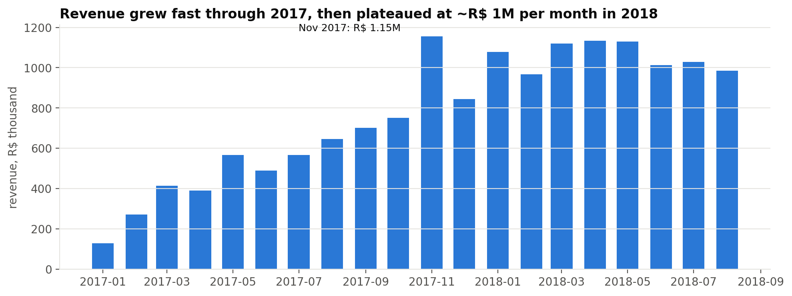
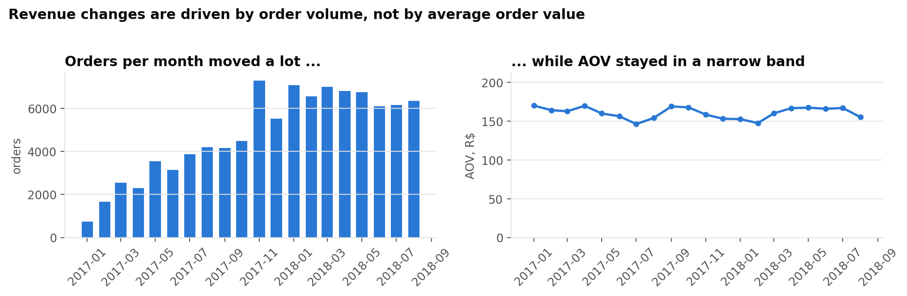
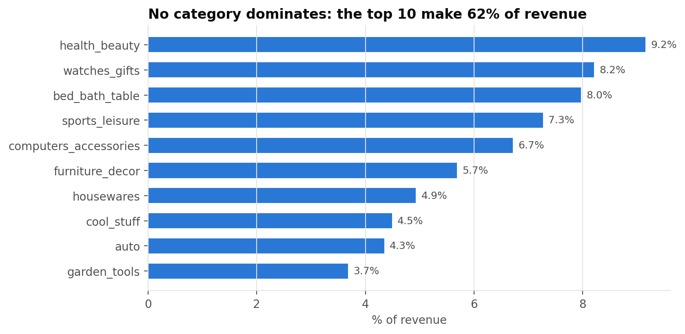
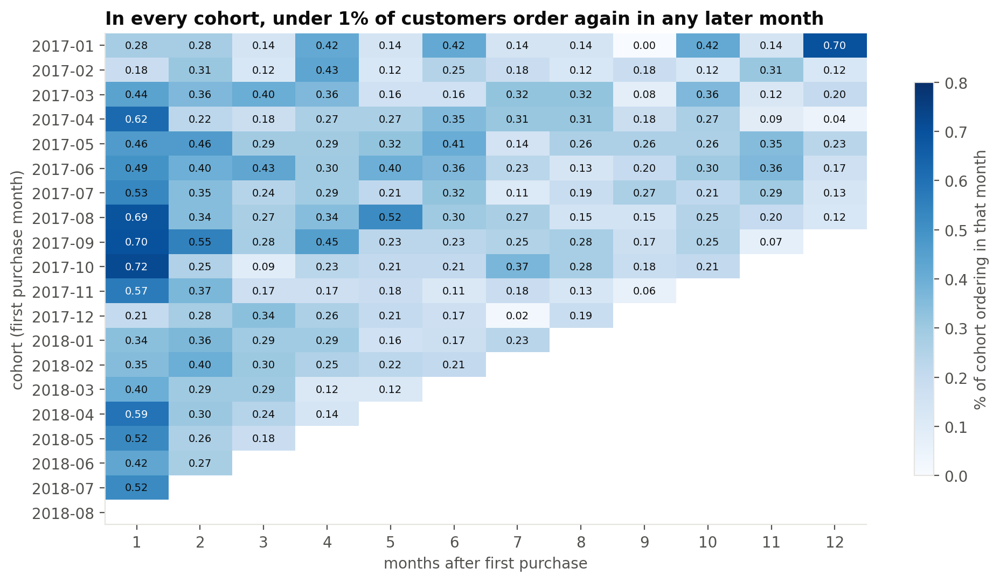
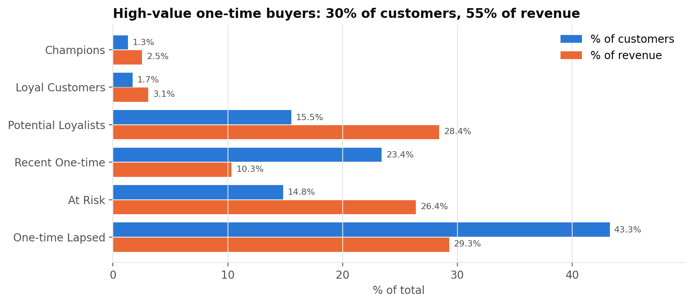
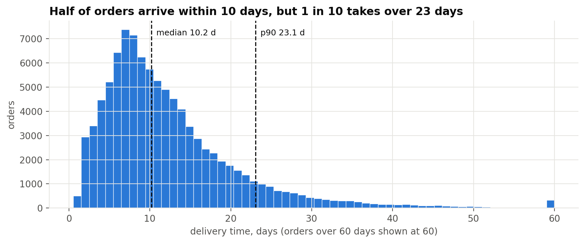
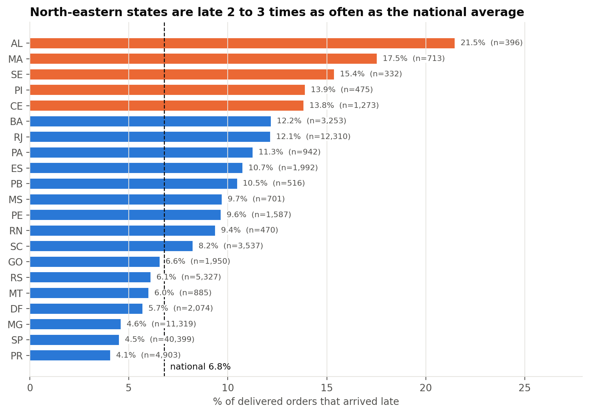
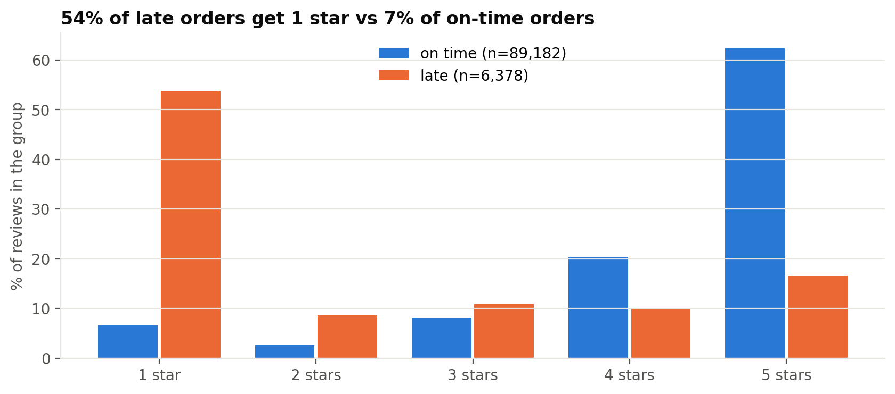
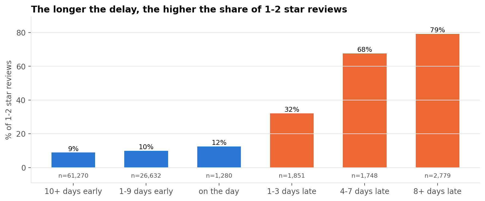

# E-commerce: Why Does Revenue Change and Who Comes Back?

[](https://github.com/Sdk0v1/ecommerce-analytics/actions/workflows/ci.yml)

> Revenue grew ~9x from Jan to Nov 2017 and then plateaued at ~R$ 1M a month; the growth came from order volume, not order value, 97% of customers never order again, and late deliveries — concentrated in the North-East — go together with review scores 2 stars lower.

**Tools:** PostgreSQL · Python (Pandas, NumPy, SciPy, Matplotlib) · Power BI
**Data:** Olist Brazilian E-Commerce Public Dataset (Kaggle) — ~100k orders, purchases 2016-09 .. 2018-10 (KPI period 2017-01 .. 2018-08)

All findings were calculated from the raw dataset; no external notebooks or analyses were used.

---

## 1. Business problem
- Revenue is growing inconsistently from month to month.
- It is unclear whether revenue changes are driven by order volume or average order value.
- The repeat purchase rate appears to be low.
- Customers complain about delivery; some regions may perform much worse.
- Are late deliveries associated with lower review scores?

## 2. Key findings (TL;DR)
- **Revenue is driven by volume, not basket size** — monthly orders ranged from 750 to 7,289 (~10x) while AOV stayed between R$ 146 and R$ 170; revenue peaked at R$ 1.15M in Nov 2017 and has plateaued at ~R$ 1.0–1.1M/month in 2018 (R1–R3).
- **Almost nobody comes back** — 97.0% of 93,358 customers ordered once; the repeat rate is 3.0% and in every monthly cohort under 1% of customers order again in any later month (C1–C3).
- **Value sits in one-time buyers** — 28,326 high-value one-time customers (RFM *Potential Loyalists* + *At Risk*) are 30% of customers but 55% of revenue; repeat buyers are 3% of customers and 6% of revenue (C5).
- **Delivery is fine nationally, bad in the North-East** — 93.2% of orders arrive on time (median 10.2 days, p90 23.1), but AL, MA, SE, PI and CE are late 14–22% of the time with median deliveries of 16–22 days (D1–D4).
- **Late orders get 2 stars less** — 2.27 vs 4.29 stars (95% CI of the difference −2.06 to −1.98); 62% of late orders get 1–2 stars vs 9% on time, and late orders are 6.7% of reviewed orders but 32.6% of all 1–2 star reviews (D5, S1–S4).

## 3. Dashboard
<!--  -->
The Power BI file is not in the repository yet — see [PowerBI/README.md](PowerBI/README.md) for the planned pages and the measure definitions. The executive page lets a manager see revenue, orders, AOV, repeat rate, on-time % and average review for any period, and drill through to a state or a category to find where delivery or retention is weak.

## 4. Data
<!--  -->
| Table | Rows | Grain |
| --- | --- | --- |
| orders | 99,441 | one order |
| order_items | 112,650 | one item line |
| customers | 99,441 | one customer_id (per order) |
| products | 32,951 | one product |
| sellers | 3,095 | one seller |
| payments | 103,886 | one payment row |
| reviews | 99,224 | one review |

After cleaning: 96,478 delivered orders, 96,211 of them in the KPI period (2017-01 .. 2018-08), 93,358 unique customers. Details in [Documentation/methodology.md](Documentation/methodology.md).

## 5. Definitions
| Term | Definition |
| --- | --- |
| Order | order with `order_status = 'delivered'` (96,478 of 99,441) |
| Revenue | `SUM(price + freight_value)` over the order's items |
| AOV | Revenue / Orders |
| Customer | `customer_unique_id` |
| Repeat customer | customer with ≥ 2 delivered orders |
| Late delivery | delivered **date** > estimated delivery **date** (delivered on the promised day = on time) |

## 6. Approach
```
Business Problem → Dataset Understanding → Data Cleaning → SQL Analysis
→ Python Validation & RFM → Statistical Analysis → Business Insights
→ Power BI Dashboard → Recommendations
```
- **PostgreSQL** holds every business definition in two views (`analytics.order_base`, `analytics.item_base`) and answers the descriptive questions (R1–R5, C1–C4, D1–D4) with window functions (LAG, RANK, PERCENTILE_CONT).
- **Python** recalculates the headline numbers independently from the raw CSVs (all 11 metrics and all 20 months match SQL exactly), builds the RFM segmentation (C5) and runs the statistics (D5, S1–S4), where bootstrapping and tests are easier than in SQL.
- **Power BI** reads the same views/exports, so the dashboard shows the same numbers as the analysis.

## 7. Analysis
### 7.1 Revenue — what drives it?
**Question:** why does revenue change month to month (R1–R5)? **Method:** monthly KPIs with LAG, decomposition ΔR = ΔN·A₀ + N₀·ΔA + ΔN·ΔA (`SQL/revenue_analysis.sql`).




**Finding:** total revenue in the KPI period was R$ 15.38M from 96,211 orders (AOV R$ 159.83). Revenue grew from ~R$ 0.13M in Jan 2017 to a Black-Friday peak of R$ 1.15M in Nov 2017, fell ~27% in Dec 2017 and then moved sideways at ~R$ 1.0–1.13M a month. Orders moved almost 10x (750 → 7,289) while AOV stayed within R$ 146–170, so the revenue changes are volume changes. No category dominates: the top 10 of ~70 categories make 62% of revenue, led by health_beauty (9.2%), watches_gifts (8.2%) and bed_bath_table (8.0%).



### 7.2 Retention — who comes back?
**Question:** what share of customers buy again, how fast, and which groups (C1–C5)? **Method:** per-customer order counts, first-purchase-month cohorts, RFM scoring.



**Finding:** 90,557 of 93,358 customers (97.0%) bought once, 2,573 twice and 228 three or more times — a 3.0% repeat rate. In every cohort from 2017-01 to 2018-07, under 1% of customers (0.02–0.72%) order in any given later month. RFM therefore works as an R × M segmentation: 14,503 *Potential Loyalists* (recent, high first order) and 13,823 *At Risk* (older, high first order) together hold 54.8% of revenue; the top 20% of customers bring 53.5% of revenue.



### 7.3 Delivery and satisfaction
**Question:** how reliable is delivery, where is it worst, and does it relate to reviews (D1–D5, S1–S4)?




**Finding:** 93.2% of 96,203 delivered orders arrived on or before the promised date. Delivery is right-skewed: median 10.2 days, p90 23.1, p99 46.0. The late rate is 6.8% nationally but 21.5% in AL, 17.5% in MA, 15.4% in SE, 13.9% in PI and 13.8% in CE; SP (4.5%), MG (4.6%) and PR (4.1%) are best. Average review is 4.16 (median 5); late orders average 2.27 vs 4.29 on time.




## 8. Statistical analysis
**Method and why:** review score is ordinal (1–5), the late group is 14x smaller and has a larger variance, so the primary results are a **bootstrap 95% CI** for the mean difference and a CI for the difference in % of 1–2 star reviews (both in business units). Welch's t-test (unequal variances), Mann-Whitney U (rank-based, suits ordinal data) and effect sizes are supporting checks.

| Result | Estimate | 95% CI |
| --- | --- | --- |
| Mean score, late − on time | −2.02 stars | −2.06 to −1.98 |
| % 1–2 stars, late − on time | +53.2 pp (62.4% vs 9.2%) | 51.9 to 54.4 pp |
| Median delivery days | 10.21 | 10.17 to 10.26 |
| p90 delivery days | 23.06 | 22.93 to 23.17 |

Welch t = −100.8 and Mann-Whitney p-values are below printable precision; Cohen's d = −1.71, rank-biserial = −0.64 (large effect).

**Robustness:** the gap exists within each of the 5 largest states (−1.63 to −2.33 stars, no CI includes 0); 1–2 star share rises with the delay (12% on the promised day → 32% at 1–3 days late → 79% at 8+ days late); removing 4,970 reviews written before the order arrived shrinks the gap to −0.77 stars (CI −0.84 to −0.69) but it stays negative.

**What it does and does not prove:** late delivery is strongly **associated** with lower scores. It does not prove causation or that removing delays would add 2 stars — category, seller, price, distance and carrier are not controlled, and customers who did not leave a review are not represented.

## 9. Recommendations
| Finding | Business impact | Recommendation | Evidence strength |
| --- | --- | --- | --- |
| Late orders: −2.0 stars, 6.7% of orders but 32.6% of 1–2 star reviews | Bad reviews and complaints concentrated in a small, identifiable set of orders | Proactively notify customers when an order is predicted to be late; set more realistic estimated dates in slow states | Strong association (CI, 3 robustness checks); not causal |
| AL, MA, SE, PI, CE late 14–22% vs 6.8% nationally | North-East customers get the worst experience | Review carriers and promised dates for the North-East first; track late % by state monthly | Strong (CIs far from national value) |
| 97% of customers buy once; repeat rate 3.0% | Growth depends entirely on acquiring new customers | Test a second-purchase campaign with a control group | Strong descriptive fact |
| 28,326 high-value one-time buyers = 55% of revenue | The group most worth re-activating is known by name | Target Potential Loyalists first, At Risk second; skip One-time Lapsed | Descriptive; segments do not predict return |
| Revenue flat at ~R$ 1M/month since Jan 2018, driven by order count | More revenue needs more orders, not bigger baskets | Focus growth KPIs on orders and new customers; AOV levers are secondary | Strong descriptive (decomposition) |

Full version: [Documentation/recommendations.md](Documentation/recommendations.md).

## 10. Limitations
- Observational data: all delivery–review results are associations; product, seller, price and carrier are not controlled.
- Reviews exist for delivered orders only and 646 delivered orders have none; customers who never review are invisible.
- 74.5% of late orders' reviews were written before the order arrived, so the headline −2.0 stars partly measures reactions to waiting (−0.8 stars after delivery).
- `customer_unique_id` can split one person across several ids (new e-mail, etc.), which would understate the repeat rate.
- Data ends 2018-08; recent cohorts are right-censored, and there is no cost/margin data, so revenue ≠ profit.
- RFM thresholds are quintiles of this dataset, not business-validated values.

## 11. Repository structure
```
SQL/
  00_create_tables.sql      raw tables, CSV load, key checks (K1-K10), keys, indexes
  01_analytics_views.sql    all business definitions: analytics.order_base, analytics.item_base
  monthly_kpis.sql          R1 - orders, revenue, AOV, MoM (LAG), rolling 3m, YoY
  revenue_analysis.sql      R2-R5 - volume vs AOV decomposition, categories, states, RANK() in states
  customer_retention.sql    C1-C4 - repeat rate, time to return, 90-day repeat, segments
  cohort_analysis.sql       cohorts, retention matrix, cumulative retention
  delivery_analysis.sql     D1-D4 - on-time %, median / p90, states, trend
  99_export_tables.sql      CSV exports for Python and Power BI
Python/
  data_cleaning.ipynb       quality checks + independent SQL validation (all metrics match)
  rfm_analysis.ipynb        C5 - RFM scoring and segments
  statistical_analysis.ipynb D3-D5, S1-S4 - bootstrap CIs, Welch, Mann-Whitney, robustness
  sql_results_figures.ipynb README figures from the SQL exports
PowerBI/                    ecommerce_dashboard.pbix
Documentation/              data dictionary, business questions, methodology, insights, recommendations
reports/figures/            all charts (generated by code)
reports/tables/             CSV exports (generated, git-ignored)
```

## 12. How to reproduce
1. Put the Olist CSVs into `data/raw/` (Kaggle: *Brazilian E-Commerce Public Dataset by Olist*).
2. Create a database: `createdb olist`
3. From the repository root run, in this order:
   ```
   psql -d olist -f SQL/00_create_tables.sql
   psql -d olist -f SQL/01_analytics_views.sql
   psql -d olist -f SQL/monthly_kpis.sql
   psql -d olist -f SQL/revenue_analysis.sql
   psql -d olist -f SQL/customer_retention.sql
   psql -d olist -f SQL/cohort_analysis.sql
   psql -d olist -f SQL/delivery_analysis.sql
   psql -d olist -f SQL/99_export_tables.sql
   ```
4. Run the notebooks in `Python/` in this order: `data_cleaning` -> `rfm_analysis` -> `statistical_analysis` -> `sql_results_figures`.
   Requirements: pandas, numpy, scipy, matplotlib, jupyter.
5. Open `PowerBI/ecommerce_dashboard.pbix` and refresh the data source.
